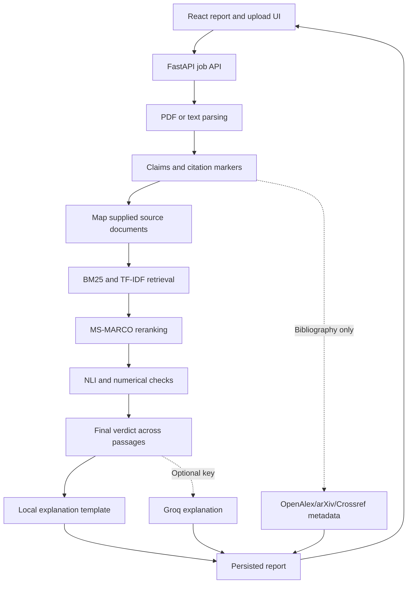

# CiteGuard

**Follow every claim back to its evidence.** A local research workbench for citation extraction, passage retrieval, natural language inference, and numerical consistency checks.


The build badge records local validation, not hosted CI. CiteGuard supports a reproducible single-process local workflow; its judgments remain research aids requiring human review.

## Features

- Parse PDFs or pasted text with citation and page provenance; expand grouped citations into individual claim/source pairs.
- Match user-supplied source documents to references, retrieve with BM25 and TF-IDF, and rerank with a cached MS-MARCO cross-encoder.
- Verify entailment and contradiction with DistilBERT MNLI, compare exact quantities and common units, and abstain when evidence is missing or conflicting.
- Enrich cited references through keyless Crossref lookup: DOI, title, venue, authors, year, and abstract when available. Preserve the original bibliography entry.
- Generate optional two-sentence Groq explanations after verification, with local templates when keys, services, or valid responses are unavailable.
- Review a dynamic support gauge, DOI links, venue badges, animated claim cards, shared-term/number highlighting, skeletons, and accessible notifications.
- Track asynchronous jobs through polling or WebSocket, replay completed results, and export JSON/CSV.
- Evaluate extraction, retrieval, verification, latency, and failure rate against a versioned synthetic dataset.

## Architecture



Metadata and LLM explanations never enter retrieval as evidence or overwrite verdicts. Without neural weights, the system reports a conservative lexical baseline explicitly.

## Quickstart

### Prerequisites

Use **Python 3.12** and **Node.js 22.12+** (Node 24 is tested), with npm. The original plan mentioned Python 3.10+ and Node 18+; the pinned scientific packages and Vite 8 require newer runtimes. These locks target the tested Python 3.12 environment. A first neural-model download needs Internet access and disk space for the model weights.

From the repository root, on Windows PowerShell:

```powershell
py -3.12 -m venv .venv312
.\.venv312\Scripts\Activate.ps1
pip install -r requirements.txt
npm install --prefix citeguard-frontend
# For repeatable installations from the lockfile, prefer:
npm ci --prefix citeguard-frontend
Copy-Item .env.example .env
python scripts/prepare_models.py
.\start.ps1
```

Skip `Copy-Item` if you already configured `.env`. Open **http://127.0.0.1:8000**. The launcher builds React and serves the compiled app through FastAPI. Ctrl+C stops the server. Model preparation is optional: without cached models the app runs the labeled baseline.

On macOS/Linux, use `python3.12 -m venv .venv`, `source .venv/bin/activate`, and `cp .env.example .env`, then install the same requirements and npm lock. Build with `npm run build --prefix citeguard-frontend` and serve with `uvicorn app.main:app --host 127.0.0.1 --port 8000`. The Windows launcher is not needed.

For development, run in two terminals with the Python environment activated:

```sh
uvicorn app.main:app --reload --host 127.0.0.1 --port 8000
npm run dev --prefix citeguard-frontend
```

The backend entrypoint is `app.main:app`, not `main:app`. Vite proxies `/api` to port 8000. Use the Vite URL printed by the dev server.

### Optional Groq key and settings

Create a key in the [Groq console](https://console.groq.com/keys) using its free tier, then put it in the root `.env` as `GROQ_API_KEY=your-key`. Restart the backend after editing settings. Free-tier requests are rate-limited; availability and quotas are controlled by Groq. The integration uses the [official Groq SDK and chat API](https://console.groq.com/docs/text-chat) with [`llama-3.1-8b-instant`](https://console.groq.com/docs/model/llama-3.1-8b-instant).

| Setting | Default | Purpose |
| --- | --- | --- |
| `GROQ_API_KEY` | empty | Enable optional hosted explanations; empty uses templates |
| `GROQ_TIMEOUT_SECONDS` | `5` | Per-request timeout, without automatic retries |
| `CROSSREF_ENABLED` | `true` | Keyless bibliography metadata enrichment |
| `CROSSREF_CONTACT` | `citeguard@example.com` | Example email in the `CiteGuard/1.0` user-agent; replace with your contact |
| `CROSSREF_TIMEOUT_SECONDS` | `3` | Maximum timeout for each network operation |
| `CITEGUARD_MODE` | `neural` | `neural` or intentional `baseline` |
| `CITEGUARD_ALLOW_DOWNLOAD` | `0` | Opt into model downloads during model loading |
| `OPENALEX_ENABLED` | `true` | Keyless bibliography metadata enrichment using OpenAlex |
| `ARXIV_ENABLED` | `true` | Keyless bibliography metadata enrichment using arXiv API |
| `API_CONTACT_EMAIL` | `citeguard@example.com` | Example email in the `CiteGuard/1.0` user-agent; replace with your contact |

`backend/config.py` loads the root `.env` regardless of the working directory. Shell variables take precedence; blank values use defaults. The API key uses Pydantic `SecretStr` and is never returned in reports. `.env` is ignored by Git. Invalid typed settings fail validation with a useful configuration error; missing keys do not prevent startup.

[Crossref and OpenAlex require no registration or API key](https://www.crossref.org/documentation/retrieve-metadata/rest-api/access-and-authentication/). DOI lookups require an exact DOI match. Bibliographic searches require an unambiguous title/author/year match. Each extraction caches duplicate requests and admits at most 20 requests within a 20-second window; an in-flight call can outlast that window by its timeout. HTTP 429 stops additional calls for that extraction. Timeouts and malformed responses preserve raw bibliography text.

Groq receives a bounded claim, selected evidence, final verdict, confidence, and numerical result. Each analysis makes at most 20 explanation calls; subsequent claims use templates. A failed request stops further calls for that analysis. Empty, excessively long, or non-two-sentence responses use templates. Generated explanations are labeled separately and can still be imperfect; the displayed verdict and source remain authoritative outputs of the verification pipeline.

For fully local operation set `CROSSREF_ENABLED=false`, `OPENALEX_ENABLED=false`, `ARXIV_ENABLED=false`, leave `GROQ_API_KEY` empty, and use cached models or baseline mode. The OpenAlex and arXiv integrations are enabled by default alongside Crossref to maximize metadata retrieval.

### Try a document

Click **Run Synthetic Demo**, or choose **Direct Text / LaTeX Input**:

- Manuscript: `The dose was 2 mg [1].`
- Source: `The dose was 2 mg.`

For uploadable examples run `python evaluation/generate_dataset.py`, then upload `data/demo/manuscript.pdf` and the source PDFs generated alongside it. For real papers, supply the cited source PDFs yourself. Prefix multiple source filenames with markers, for example `[2] Study.pdf`. A single supplied source is treated as the user-selected source. The text API also accepts explicit `sources: [{name, text, markers: ["[2]"]}]` mappings.

Missing source text produces insufficient evidence. Citation markers include `[1]`, `[1, 3-5]`, `(Smith et al., 2020)`, and `Smith (2020)`. Overlap highlighting shows shared lexical terms and numbers, not proof of entailment or a named-entity recognition result.

## API

Interactive documentation: **http://127.0.0.1:8000/docs**.

| Endpoint | Behavior |
| --- | --- |
| `GET /api/health` | Health and configured neural/baseline mode |
| `POST /api/verify` | Multipart `target_file`, optional repeated `source_files`; returns 202 and `job_id` |
| `POST /api/analyze-text` | JSON `target_text`, optional `source_text`/`sources`, `document_title`; returns 202 |
| `GET /api/jobs/{job_id}` | Queued, progress, completed, or error state |
| `GET /api/results/{job_id}` | Report; 409 while pending, 422 on analysis failure |
| `WS /api/ws/{job_id}` | Current state and subsequent changes; closes normally after completion/error |
| `GET /api/export/{job_id}?format=json` | JSON report; `format=csv` also supported |
| `GET /api/benchmark` | Run the nine-fixture synthetic demo |
| `GET /api/metrics` | Compute the Week 3 evaluation metrics |

Uploads require a `.pdf` filename and PDF signature. Non-PDF content returns 400; oversized files return 413. Each file is limited to 25 MB and each job to 30 source PDFs. Corrupt PDFs that pass the signature check become terminal analysis errors. `Unrelated` remains the legacy API label for insufficient evidence.

Reports include `reasoning`, `reasoning_provider`, numerical comparisons, evidence candidates, and reference metadata per claim. Jobs persist under `data/jobs`; pending jobs interrupted by a restart are reported as errors. Run **one server worker** because active job coordination is in memory.

## Tests and evaluation

```sh
python -m pytest -q
python -m ruff check app backend tests evaluation scripts
python -m pip check
npm run lint --prefix citeguard-frontend
npm run build --prefix citeguard-frontend
python -m app.evaluation.run_evaluation
```

The final integration suite is `backend/tests/test_final_pipeline.py`. It covers keyless metadata, configuration precedence, missing keys, request timeouts, invalid service output, cache isolation, rate-limit fallback, unchanged verdicts after explanation generation, invalid PDF uploads, complete analysis, and normal WebSocket closure. External providers are mocked in these tests; no paid requests or API keys are required. Existing neural integration tests use cached model weights, prepared with `scripts/prepare_models.py`.

Deprecation and runtime warnings fail the test suite. One narrow documented exception covers Starlette 1.6.0's deprecated AnyIO `BlockingPortal` import; Pydantic and application async warnings remain errors.

The evaluator writes `evaluation_results.json` with extraction recall/precision; retrieval Recall@1/3/5, Precision@3 and MRR; three-class accuracy and macro precision/recall/F1; processing time, per-citation latency and failure rate. Numerical mismatch maps to contradiction for the three-class evaluation. Failed documents stay in the denominator. Precision@3 uses three ranks even when fewer passages are returned.

The nine fixtures in `evaluation/golden_standard.json` are **synthetic integration examples**, not a real-world accuracy benchmark. Add independently reviewed, representative papers and a held-out split before making research accuracy claims. Parameter sweep scripts in `app/evaluation` are exploratory.

## Repository and stack

```text
app/                         FastAPI, parsing, extraction, retrieval, verification
backend/config.py            Pydantic Settings and secret handling
backend/modules/             Crossref and Groq integrations
backend/tests/               Week 4 integration regression tests
citeguard-frontend/           Active React + TypeScript + Vite frontend
  src/components/            ClaimCard, DocumentSummary, Toast, ReportSkeleton
  package.json               Exact direct dependency versions
  package-lock.json          Transitive npm dependency lock
frontend/                    Historical static frontend (not the active app)
tests/                       Existing extraction/retrieval/API/neural tests
evaluation/                  Synthetic fixtures and PDF generator
requirements.txt             Installation entrypoint
requirements-lock.txt        Exact Python dependency versions
```

FastAPI, Pydantic v2/settings, pdfplumber, scikit-learn, PyTorch, Transformers, Sentence Transformers, requests, Groq SDK, React 19, TypeScript, Tailwind CSS 4, Vite 8, Lucide, pytest and Ruff. Existing source paths are retained to keep Week 1–3 imports and launcher behavior compatible.

## Scope and contributions

Designed for local research use. There are no user accounts, public-hosting controls, durable distributed queue, OCR, or automatic full-text acquisition. Complex layouts, tables, cross-page sentences and uncommon citation styles can need correction. General-domain NLI can make mistakes; confidence is not a calibrated truth probability. Numerical matching does not fully model statistical significance or entity-role swaps. Results are stored on disk until you remove them.

Original responsibility areas: **Jagadish** — parsing/extraction and metadata; **Jayant** — retrieval and evaluation; **Dhanush** — NLI and numerical verification; **Tanush** — frontend and integration leadership. Week 4 integrates these roles in a single development pass. Contributions should include a concrete regression example and the relevant checks above. See [LICENSE](LICENSE).
