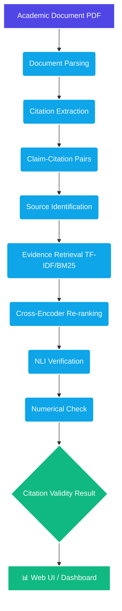

  
#  CiteGuard
**Citation Verification and Evidence Alignment System**

*Upload a research paper → Extract claims & citations → Retrieve evidence → Verify via NLI & Numerical checks → See validity results!*

---

##  What is CiteGuard?

CiteGuard is an automated, end-to-end pipeline designed to verify citations in academic documents. It systematically parses research papers, identifies claims and their associated citations, cross-references them with the original source, and uses Natural Language Inference (NLI) to mathematically and contextually verify if the cited evidence actually supports the claim.

###  Core Features

- ** Smart Document Parsing:** Extracts text, paragraphs, and sections while preserving page numbers.
- ** Claim & Citation Extraction:** Detects complex citation groups and binds them to the claims they support.
- ** Intelligent Evidence Retrieval:** Uses TF-IDF & BM25 to sift through sources and retrieve candidate evidence.
- ** Cross-Encoder Re-ranking:** Re-ranks the evidence to find the most contextually relevant passages.
- ** Advanced Verification:** Employs NLI (Entailment/Contradiction/Neutral) and Numerical checks for rock-solid claim verification.
- ** Interactive Dashboard:** A sleek Web UI to upload PDFs, visualize the extraction pipeline, and view confidence scores.

###  Tech Stack

- **Backend & API:** Python, FastAPI
- **Machine Learning & NLP:** PyTorch, Hugging Face Transformers (Cross-Encoder, NLI)
- **Document Processing:** PyMuPDF / pdfplumber
- **Retrieval Engine:** BM25 / TF-IDF (scikit-learn / Rank-BM25)
- **Frontend UI:** Next.js / React (or Vanilla JS & CSS for a lightweight dashboard)

---

##  Architecture & Pipeline

Here is the high-level flow of data through CiteGuard:

---

## 🚀 Getting Started (Coming Soon)

Instructions on how to set up the Python environment, start the Backend API, and run the Frontend UI will be updated here as the foundational architecture is finalized. 

*Stay tuned for the setup guide!*

---

> **Mission Statement:** "A simple working CiteGuard is better than an ambitious system with broken integration." 🛡️
