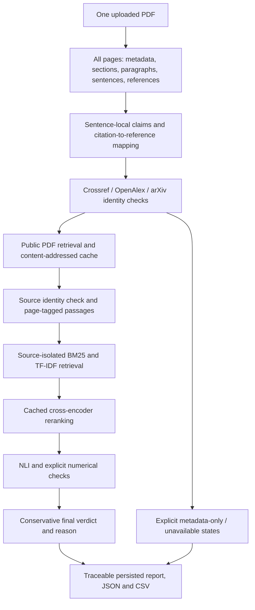

# CiteGuard

Upload one research PDF, click **Verify**, and inspect each citation against passages from the actual cited source. The UI does not require claims, source papers, or URLs from the user. Results are automated research judgments, not a measured accuracy guarantee.

## Pipeline


```mermaid
flowchart TD
    PDF[One uploaded PDF] --> Parse[All pages: metadata, sections, paragraphs, sentences, references]
    Parse --> Map[Sentence-local claims and citation-to-reference mapping]
    Map --> Identify[Crossref / OpenAlex / arXiv identity checks]
    Identify --> Fetch[Public PDF retrieval and content-addressed cache]
    Fetch --> Text[Source identity check and page-tagged passages]
    Text --> Retrieve[Source-isolated BM25 and TF-IDF retrieval]
    Retrieve --> Rerank[Cached cross-encoder reranking]
    Rerank --> Verify[NLI and explicit numerical checks]
    Verify --> Decision[Conservative final verdict and reason]
    Decision --> Report[Traceable persisted report, JSON and CSV]
    Identify --> Unavailable[Explicit metadata-only / unavailable states]
    Unavailable --> Report
```

The complete document structure is built before source lookup. Citation groups share a claim ID while each cited reference gets a separate verification result. Candidate matching records DOI, title, author and year checks; ambiguous candidates are rejected. Source downloads follow public PDF links, publisher citation metadata and exact arXiv identifiers. Metadata and abstracts are never treated as verification evidence. The uploaded target is excluded as its own automatically retrieved evidence.

Evidence retains source ID, URL, page, paragraph and section. Lexical retrieval, cross-encoder reranking, NLI probabilities and numerical calculations are separate fields. Optional Groq explanations run after the decision and cannot change it.

## Local setup

Use Python 3.12 and Node.js 22.12+ with npm. Node 24 was used for validation.

```powershell
py -3.12 -m venv .venv312
.\.venv312\Scripts\Activate.ps1
pip install -r requirements.txt
npm ci --prefix citeguard-frontend
# Only if .env does not already exist:
Copy-Item .env.example .env
# Explicit, optional model download:
python scripts/prepare_models.py
.\start.ps1
```

Open http://127.0.0.1:8000. Select a PDF, click Verify, wait for source lookup and verification, then inspect results. Reports can be reopened using `?job=<job_id>`. JSON and CSV exports use the canonical decisions.

On Linux/macOS, create/activate a Python 3.12 virtual environment, install the same requirements, run `npm ci --prefix citeguard-frontend`, `npm run build --prefix citeguard-frontend`, then `uvicorn app.main:app --host 127.0.0.1 --port 8000`. Development uses that backend plus `npm run dev --prefix citeguard-frontend` in a second terminal.

### Configuration and network behavior

Root `.env` is loaded automatically; environment variables override it. Secrets are not included in reports.

| Setting | Default | Purpose |
| --- | --- | --- |
| CITEGUARD_MODE | neural | Use neural models, or intentional baseline mode |
| CITEGUARD_ALLOW_DOWNLOAD | 0 | Model loading uses only cached weights unless explicitly enabled |
| CROSSREF_ENABLED / OPENALEX_ENABLED / ARXIV_ENABLED | true | Scholarly metadata providers |
| API_CONTACT_EMAIL | citeguard@example.com | Replace with a real contact for scholarly API requests |
| OPENALEX_API_KEY | empty | Optional OpenAlex authentication |
| SOURCE_CONCURRENCY | 3 | Concurrent reference resolutions, bounded to 1–5 |
| SOURCE_TIMEOUT_SECONDS | 15 | Timeout per source HTTP operation |
| SOURCE_MAX_BYTES | 26214400 | Maximum downloaded source PDF size |
| GROQ_API_KEY | empty | Optional hosted explanations; otherwise local templates |
| GROQ_TIMEOUT_SECONDS | 5 | Explanation request timeout |

There are no silent model downloads by default. Missing NLI weights yield INSUFFICIENT_EVIDENCE, never a lexical-only SUPPORTED final verdict. Missing reranker weights leave reranking scores absent while lexical retrieval remains available.

Source fetching has a 45-second total bound per location, at most five candidate locations per reference, redirect validation, private/reserved-address blocking, PDF signature checks and a size cap. PDFs are cached by SHA-256 in `data/sources`; URL manifests reuse validated cached files for seven days. Provider timeouts/rate limits preserve explicit failure states. No paywall bypass or paid full-text service is used. Bibliographic queries leave this machine. If Groq is configured, selected claims and evidence also leave this machine for explanation generation. Uploaded files and job reports are stored locally; manage their retention yourself.

## Decisions

The authoritative API field is `final_verdict`, accompanied by `decision_reason`. Legacy `status` and confidence fields remain for compatibility and must not be interpreted as the final decision.

| Decision | Meaning |
| --- | --- |
| SUPPORTED | Selected passage entails the claim and applicable numerical checks do not conflict |
| PARTIALLY_SUPPORTED | A conservative clause split finds support for one component, with another unresolved |
| CONTRADICTED | NLI finds contradiction, or an explicit arithmetic check fails |
| INSUFFICIENT_EVIDENCE | Available passages, model state or numerical checks cannot establish the claim |
| SOURCE_UNAVAILABLE | No accepted accessible full text or usable metadata result |
| SOURCE_METADATA_ONLY | Source identified but full text was not retrieved |
| NOT_VERIFIABLE | Navigation/acknowledgement or flattened table without a safely isolated assertion |
| EXTRACTION_FAILED | Retrieved PDF could not provide usable text |

Unavailable full text is never interpreted as a false claim. Conflicting passage judgments and truncated NLI input abstain. A numerical value absent from evidence is unresolved, not automatically contradicted. Explicit percentage-point and relative-percent arithmetic are supported; ambiguous percent wording abstains.

## Validation

```powershell
.\.venv312\Scripts\python.exe -m pytest -q --basetemp .pytest-tmp-check
.\.venv312\Scripts\python.exe -m ruff check app backend tests scripts/e2e_pdf.py
npm run build --prefix citeguard-frontend
npm run lint --prefix citeguard-frontend
.\.venv312\Scripts\python.exe scripts/e2e_pdf.py attention.pdf --output data/e2e-attention-final.json
```

The E2E script performs a real multipart upload through FastAPI, executes the actual asynchronous job, polls completion and saves the full report. Its PDF path is arbitrary; the application contains no hardcoded example paper or results. The last command requires a local copy of that public paper and network access. See [the implementation and validation report](docs/IMPLEMENTATION_REPORT.md) for observed results and file-by-file changes.

## Known limitations

- Numbered bracket citations and common parenthesized/inline author-year patterns are recognized. Superscripts, footnote-only styles, complex author-year groups and unnumbered bibliographies are incomplete.
- Page text is retained, but reading order, columns, tables, equations and reference boundaries are heuristic. No OCR is implemented. Scanned/image-only PDFs cannot be verified.
- Claim association is sentence-local. Shared or long citation-bearing sentences are marked uncertain. Navigation/table detection and partial-support clause splitting are heuristics, not semantic claim decomposition.
- Bibliography fields and frontmatter authors are best-effort. DOI/arXiv/title/author/year checks reduce mismatches but cannot guarantee source identity; rejected or ambiguous matches remain unresolved.
- Some scholarly servers time out, throttle, block automated requests or expose only metadata. A fresh run can have different source coverage. Cached PDFs improve repeatability, not availability guarantees.
- DistilBERT MNLI and MS-MARCO models are general-purpose models, not calibrated scientific fact checkers. NLI can misread negation, long context, tables, equations and technical language. Review original passages; model confidence is not probability of correctness.
- Numerical support covers explicit quantities and narrowly defined percentage changes. Statistical significance, confidence intervals, implicit baselines, derived formulas and semantic measurement alignment are incomplete. Matching numbers alone does not prove a claim.
- Jobs use a single-process local store. There is no distributed queue, account isolation, production retention policy or hardened multi-user deployment. Keep the default loopback binding.
